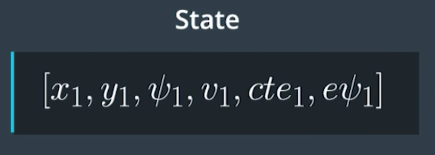
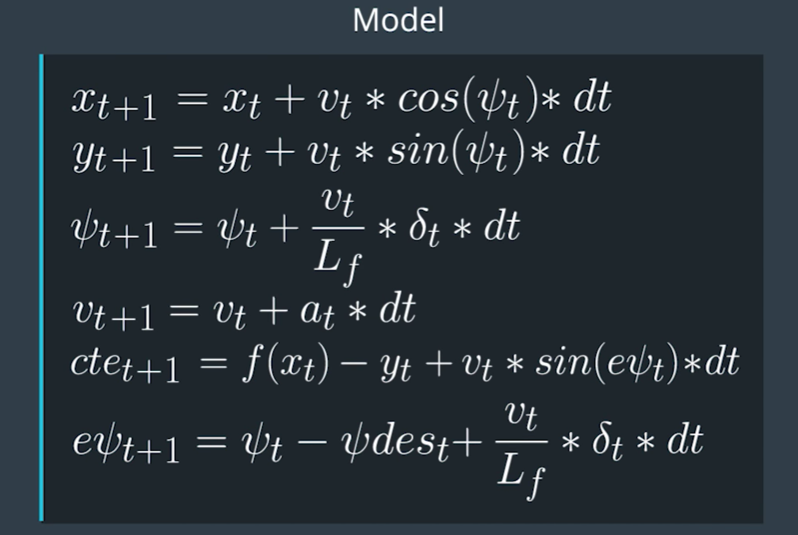
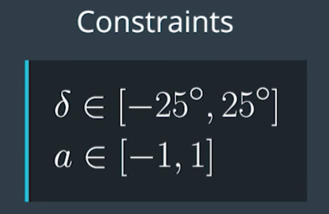
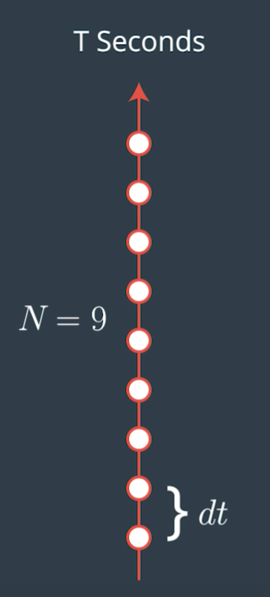

# Model Predictive Controller

Self-Driving Car Engineer Nanodegree Program

---

### Introduction

The goal of this project is to build a model predictive controller to maneuver a car in the simulator. MPC estimates the path for the next few steps based on the current system state to arrive at the parameters for actuating the vehicle. The process is continued on every single step to predict the path for the upcoming few steps based on the new system state.  

### System State

The state of the system is defined by the position of the car `x`  and `y`, heading of the car `psi`, velocity `v`, cross-track error `cte` and orientation error `epsi`. The system has two actuators steering angle (wheel) `delta` and accelerator (throttle) `a`. The model should consider the current system state, estimate the expected system state in `dt` and provide controls to the actuators. 

### Model

The system model can be mathematically defined as shown in the below image, where `Lf` is the distance between the center of gravity (CoG) and the front axle of the vehicle which is a constant for a given vehicle. The model best fits an ideal world, where the true interaction between the tries and road such as slipping, skidding, air-drag etc are ignored. 

##### System Model

##### Actuators & Constraints

Steering angle and throttle are the two actuators that will be controlled by the model. The actuators are constrained with practical limits, eg. the steering angle cannot be any more than `25 degrees` in either direction and the maximum acceleration can only be in the range of `-1 and +1`. Negative value indicating brake and positive indicating throttle. 

### Approach

The model predicts the next `N` steps in the target trajectory based on the current system state. The number of future steps and the time difference between the steps are critical hyperparameters that needs to be optimized. In a realistic world, the actuators imposes an inherent delay in causing the expected result in the system, the simulator here accounts for this delay by introducing a 100ms latency to actuate the final system parameters. Therefore, before optimizing the cost function this predicted trajectory is updated to account for this latency.

### Results and Discussion

##### Hyperparameters

Attempted to run Twiddle and arrive at the hyperparameters, but it was causing the code to become quite unstable, definitely implementing Twiddle right way will help arrive the right hyperparameters for PID controller. As of now, this project has manually optimized hyperparameter based on the experience from attempting Twiddle implementation. The drawback with this primitive setup was the speed of simulation was fairly limited.

Having just one PID controller for actuating the steering wheel resulted in a smooth control of the vehicle in the simulator. When a second controller was added to actuate the throttle, the execution in the simulator was wavy the PID was overcontrolling the system. But it was able to accomplish higher speeds.

As far the manual optimization goes, it was very surprising to see the differential component had less impact than the integral component. If the simulator was built with basic physics engine in Unity, it would have responded more for the proportional and differential component and than the integral component. It sounds like the simulator was programmed considering some real world factors to closely simulate on road conditions.

### Video
 

##### Quick Animation

### Basic Build Instructions

1. Clone this repo.
2. Make a build directory: `mkdir build && cd build`
3. Compile: `cmake .. && make`
4. Run it: `./pid`. 
