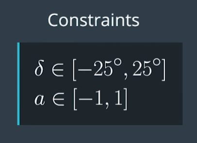
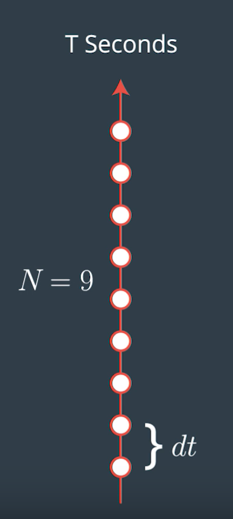
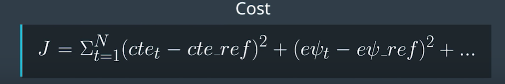

# Model Predictive Controller

Self-Driving Car Engineer Nanodegree Program

---

### Introduction

The goal of this project is to build a model predictive controller to maneuver a car in the simulator. MPC estimates the path for the next few steps based on the current system state to arrive at the parameters for actuating the vehicle. The process is continued on every single step to predict the path for the upcoming few steps based on the new system state.  

### System State

The state of the system is defined by the position of the car `x`  and `y`, heading of the car `psi`, velocity `v`, cross-track error `cte` and orientation error `epsi`. The system has two actuators steering angle (wheel) `delta` and accelerator (throttle) `a`. The model should consider the current system state, estimate the expected system state in `dt` and provide controls to the actuators. 


### Model

The system model can be mathematically defined as shown in the below image, where `Lf` is the distance between the center of gravity (CoG) and the front axle of the vehicle which is a constant for a given vehicle. The model best fits an ideal world, where the true interaction between the tries and road such as slipping, skidding, air-drag etc are ignored. 

##### System Model


##### Actuators & Constraints

Steering angle and throttle are the two actuators that will be controlled by the model. The actuators are constrained with practical limits, eg. the steering angle cannot be any more than `25 degrees` in either direction and the maximum acceleration can only be in the range of `-1 and +1`. Negative value indicating brake and positive indicating throttle. 



### Approach

The model predicts the next `N` steps in the target trajectory based on the current system state. The number of future steps and the time difference between the steps are critical hyperparameters that needs to be optimized. In a realistic world, the actuators imposes an inherent delay in causing the expected result in the system, the simulator here accounts for this delay by introducing a 100ms latency to actuate the final system parameters. Therefore, before optimizing the cost function this predicted trajectory is updated to account for this latency.



The below values for no. of steps and step duration seems to work very well for the model. 

```
size_t N = 10;
double dt = 0.1;
```

A 3rd order polynomial is fit over the projected waypoints, this path will be optimized for `cte & epsi` using the below cost function. 



To ensure smooth transition of actuators values the gap between the actuator values for consecutive points are heavily penalized during cost function optimization to avoid drastic swerve motion in the vehicle. For both the actuators upper and lower bound values are set to practical limits. In case of steering angle the maximum limits are set to `± 0.43632/Lf`, where `Lf` is distance between center of gravity and front axle. The resulting actuator vector is applied only on the very first step and the process is continued after every single step to continuously project/predict the target path. 


### Video
 
[YouTube Link](https://youtu.be/NcV38tI-EmM )

##### Quick Animation


### Build instructions for mac os x

1. Clone this repo.
2. Run `brew install mumps`
3. Run `brew install ipopt` 
2. Make a build directory: `mkdir build && cd build`
3. Compile: `cmake .. && make`
4. Run it: `./mpc`. 
